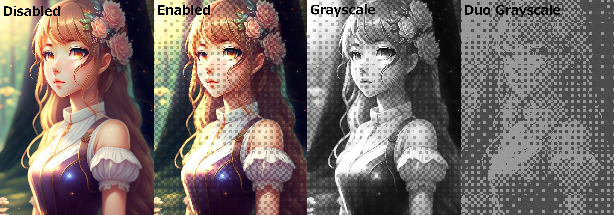
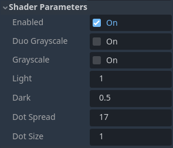

# MangaToneShader for Godot 4x

This is a 2D shader which adds a dot matrix to your Godot sprites, resembling the art style of manga.

Reference image by [Sketchepedia](https://www.freepik.com/free-ai-image/girl-with-flower-her-head_40545672.htm#query=anime%20girl&position=5&from_view=search&track=ais) (Freepik Free License).